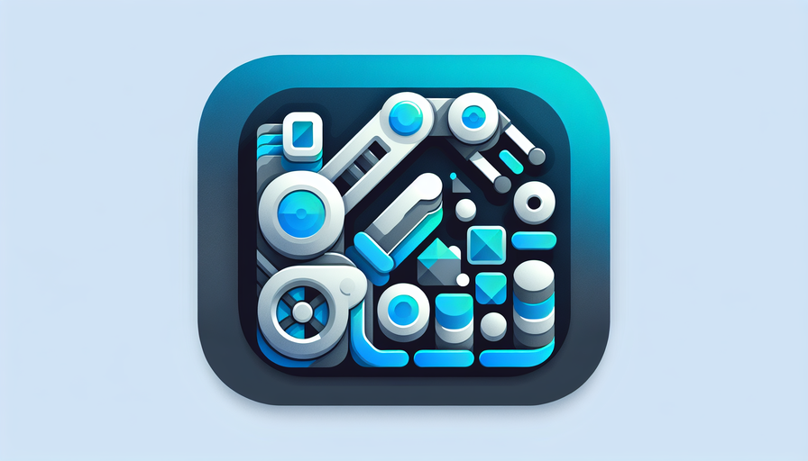

<div id="top">

<!-- HEADER STYLE: COMPACT -->


# ANDROID-UI-COMPONENTS

<em>Reusable and customizable Android UI components built with View-based architecture for XML
layouts and classic UI development.</em>

<!-- BADGES -->


<br clear="left"/>

## ☀️ Table of Contents

- [🌞 Overview](#-overview)
- [🔥 Features](#-features)
- [🌅 Project Structure](#-project-structure)
- [🚀 Getting Started](#-getting-started)
    - [🌟 Prerequisites](#-prerequisites)
    - [⚡ Installation](#-installation)
    - [🔆 Usage](#-usage)
    - [🌠 Testing](#-testing)
- [🌻 Roadmap](#-roadmap)
- [📜 License](#-license)
- [✨ Acknowledgments](#-acknowledgments)

---

## 🌞 Overview

Android UI Components is a modular library of reusable and customizable UI components for Android
apps. Built with the classic View system and XML layouts, it provides visually appealing shimmer
effects and smooth placeholders for loading states. The project emphasizes performance with
GPU-accelerated animations and includes benchmarking tools for measuring efficiency.

---

## 🔥 Features

|     | Component         | Details                                                                                                                                                                                                                                                                    |
|:----|:------------------|:---------------------------------------------------------------------------------------------------------------------------------------------------------------------------------------------------------------------------------------------------------------------------|
| ⚙️  | **Architecture**  | Modular Gradle setup with separate modules for library, benchmarking, and sample app. Components use XML layouts combined with Kotlin source files and Android resource files for themes, colors, and assets. Supports separation of placeholder and real content layouts. |
| 🔩  | **Code Quality**  | Kotlin DSL for Gradle build scripts, ProGuard and consumer rules for code shrinking and obfuscation, consistent naming conventions, and benchmarking focus for performance improvements.                                                                                   |
| 📄  | **Documentation** | Technical specifications and design details are documented in `docs/tech-spec.md`. Resource files use descriptive naming to aid understanding and maintainability.                                                                                                         |
| 🔌  | **Integrations**  | Integration with Gradle for CI/CD, Android resource system for layouts and drawables, ProGuard configurations, and benchmarking infrastructure as a separate module.                                                                                                       |
| 🧩  | **Modularity**    | Multi-module project: `library`, `benchmark`, `sample`, and `buildSrc`. Resources are organized by function for easy management and reuse.                                                                                                                                 |
| 🧪  | **Testing**       | Benchmark module included for performance tests. Instrumentation tests validate UI components' behavior and correctness.                                                                                                                                                   |
| ⚡️  | **Performance**   | GPU-accelerated shimmer views, dedicated benchmarking to compare CPU vs GPU shimmer implementations, and ProGuard optimizations help keep runtime efficient and APK size small.                                                                                            |
| 🛡️ | **Security**      | ProGuard rules and backup/data extraction policies configured to protect app data and code integrity.                                                                                                                                                                      |

---

## 🌅 Project Structure

```plaintext
android-ui-components/
├── LICENSE
├── README.md
├── benchmark/          # Performance benchmarking module
├── build.gradle.kts    # Root build configuration with Kotlin DSL
├── buildSrc/           # Shared build logic and configuration
├── commit_info.sh      # Script to collect git commit info
├── docs/               # Documentation and technical specs
├── gradle/             # Gradle wrapper and version catalogs
├── library/            # Main UI components library module
├── sample/             # Sample app demonstrating components
└── settings.gradle.kts # Module inclusion and repository settings
```

For a detailed file overview, see the [Project Index](#-project-structure) section above or the
repository tree.

---

## 🚀 Getting Started

### 🌟 Prerequisites

- [Android Studio](https://developer.android.com/studio) (latest stable recommended)
- [JDK 11](https://jdk.java.net/11/) or higher
- Gradle (wrapper included)
- Android SDK with minimum API level configured (check `library/build.gradle.kts` for details)

### ⚡ Installation

1. Clone the repository:

   ```bash
   git clone https://github.com/nikkiw/android-ui-components.git
   ```

2. Navigate into the project directory:

   ```bash
   cd android-ui-components
   ```

3. Build the project and download dependencies:

   ```bash
   ./gradlew build
   ```

### 🔆 Usage

To run the sample application on an emulator or connected device:

```bash
./gradlew :sample:installDebug :sample:assembleDebug
```

Or open the project in Android Studio and run the `sample` module.

You can then integrate the UI components library in your own projects by adding the `library` module
as a dependency or publishing and including it via Maven.

### 🌠 Testing

Run the benchmark and unit tests with:

```bash
./gradlew :benchmark:connectedAndroidTest
./gradlew :library:test
./gradlew :sample:connectedAndroidTest
```

Note: Instrumented UI tests require an emulator or device.

---

## 🌻 Roadmap

- [X] Implement base shimmer UI components (CPU-based)
- [X] Add GPU-accelerated shimmer implementation
- [X] Setup benchmarking infrastructure to compare shimmer performance
- [ ] Expand with more customizable UI placeholders and loaders
- [ ] Add comprehensive unit and UI tests coverage
- [ ] Publish library to Maven Central / JCenter for easy integration
- [ ] Extend documentation and usage samples

---

## 📜 License

This project is licensed under the Apache License 2.0. See the [LICENSE](./LICENSE) file for
details.

---

## ✨ Acknowledgments

- Thanks to all contributors and users inspiring the project.
- Inspired by popular Android UI libraries and Google’s Material Design guidelines.
- Special mention to the Android community for sharing knowledge on UI performance optimization.

<div align="right">

[](#top)

</div>